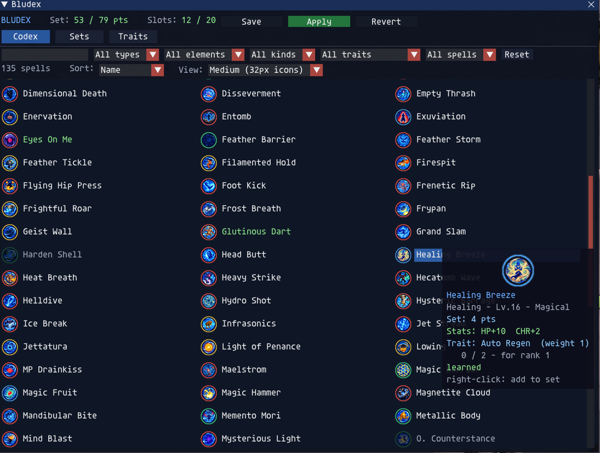
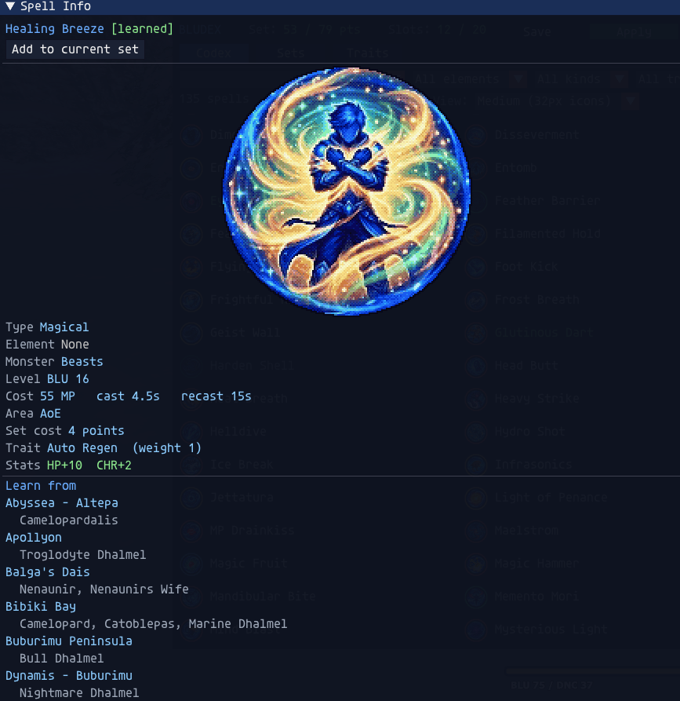
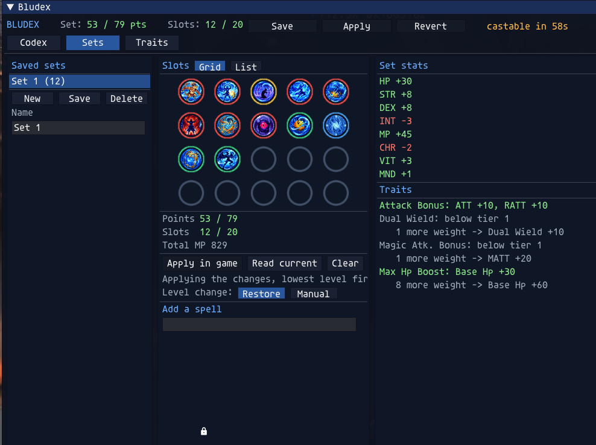
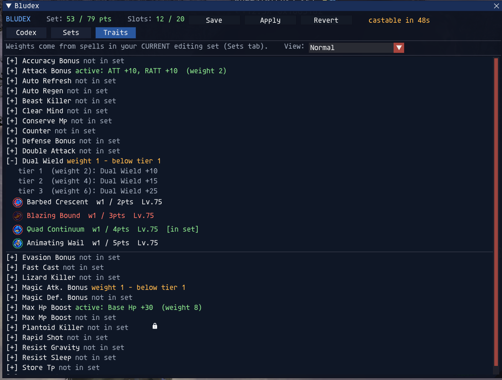

# Bludex

**The Blue Mage codex for [Ashita v4](https://www.ashitaxi.com/) on [CatsEyeXI](https://catseyexi.com/)** — a filterable
spell reference, a visual set planner, and safe in-game set application, with hand-made
icons for every spell.

Bludex combines what `blucheck` and `blusets` did — and goes further:

- **Spell codex** — every blue magic spell castable at the level-75 cap (including all
  CatsEyeXI additions) as icon+name rows in up to three columns. Filter by name,
  category, element, spell type, trait, and learned/missing; sort by name, level, or
  type; pick your view density (64px / 32px / 24px icons, or a compact text-only list).
  Hover any spell for a rich tooltip — artwork, stats, set cost, its trait and your
  set's progress toward the next trait rank. Click for the full Spell Info window:
  cast/recast, skillchain properties, magic-burst windows, stat bonuses, and where to
  learn it.
- **Set planner** — 20 slots as a spatial grid or a named list, a live set-point budget
  read from the game client (CatsEyeXI's custom merit/learning bonuses included), total
  stat and trait summaries, and saved sets that survive relogs. Spells you haven't
  learned can't be added; spells not yet active in game show dimmed.
- **One grammar everywhere** — in the codex, the trait explorer, and the set list alike:
  left-click opens Spell Info, right-click adds or removes the spell from your set,
  green means "in the set".
- **Applying is fast and tidy** — Save / Apply / Revert live in the window header and
  light up green when they have work. Apply sends only what changed, always producing a
  **level-sorted set list** in game (lowest level in slot 1 — what a level-down spares).
  A countdown and a chat line track the game's ~60s cast lock after set changes.
- **Restore on level change** (opt-in) — when a level sync strips spells from your set,
  Bludex puts them back automatically once they fit again, lowest level first, and tells
  you how many stuck.
- **Trait explorer** — every blue trait ladder (Dual Wield, Attack Bonus, …), which
  spells feed it, and what to add for the next tier.

## A tour

### The codex



Every castable spell, filterable and sortable, at your chosen density (Medium 32px
here). **Green names are in your current set**, dim names aren't learned yet. Hovering
shows the tooltip: artwork, category/level/kind, set cost, the spell's stat bonuses,
its trait — and your set's live progress toward that trait's next rank (`0 / 2 - for
rank 1`). Right-click adds or removes without opening anything. The header is always
in view: the editing set's points and slots, and **Save / Apply / Revert** — Apply
glows green because this set hasn't been sent to the game yet.

### Spell Info



Left-click any spell for the full picture in its own window: the add/remove button
right at the top, then the artwork and everything the data layer knows — type,
element, monster family, level, MP/cast/recast, AoE, set cost, trait contribution,
stat bonuses, and every zone and mob that can teach it. In the dlac flavor this window
floats free of dlac's main box.

### The set planner



Your 20 slots as a spatial grid (or a named list — the `Grid | List` toggle), with the
live budget, slot count, and total MP beneath. Empty slots are quiet rings; icons dim
until the game actually has them equipped. The right panel totals the set's always-on
stat bonuses and trait ladder progress, including what one more feeder spell would
unlock. `Level change: Restore` is armed here — after a level sync strips spells,
Bludex re-adds them automatically. The amber **`castable in 58s`** in the header is
the game's own post-change cast lock, counted down for you (a chat line announces when
it ends).

### The trait explorer



Every blue trait as a ladder: which tiers exist, which one your set has active
(green), and how much weight the next needs. Expand a trait to see its feeder spells —
green ones are in your set, red ones you haven't learned — and right-click to add or
remove them on the spot. The same tooltips, densities, and Spell Info clicks as the
codex: one grammar everywhere.

## Install

**Standalone:** drop this repository into `Ashita/addons/bludex/` and `/addon load bludex`.
`/bludex` (or `/bdx`) toggles the window.

**Already running [dlac](https://github.com/henkpoa/dlac)?** You have Bludex — it ships
inside dlac as the Job helper `jobhelpers/blu/bludex` (a Bludex row on the Job Helpers
tab, and in the quick menu's *Job helpers* cascade; choosing it pops the Bludex window).
Do not run the standalone addon and the dlac flavor at the same time.

## Commands

```
/bludex            toggle the window            /bludex apply <name>   apply a saved set
/bludex list       list saved sets              /bludex reset          unset every spell
/bludex refresh    re-request job data          /bludex delay <0.2-5>  seconds between packets
/bludex mode safe|fast                          /bludex debug          signature/points diagnostics
/bludex import [name]  import blusets spell lists as saved sets
```

Migrating from the `blusets` addon? `/bludex import` (or the *Import blusets* button on
the Sets tab) pulls every saved list from `config/addons/blusets/*.txt` in as bludex
sets, slot for slot. A name that already exists in bludex is skipped, never overwritten.

## For developers

- `lua bludex/tools/smoke.lua` (from `Ashita/addons/`) — the headless suite.
- The library is **relocatable**: every module derives its require root from its own
  module name, which is what lets dlac vendor it unmodified. On every push to `main`,
  `.github/workflows/sync-dlac.yml` copies the library + the dlac adapter
  (`dlacmodule/`) into the dlac repository. `tools/vendor_local.py` does the same copy
  locally for field-testing. See [INTEGRATION.md](INTEGRATION.md).
- `data/*.lua` are **generated** — never hand-edit: spells/traits/hints by
  `tools/generate_spells.py`, weaponskills (the Skillchain-partners window's data)
  by `tools/generate_weaponskills.py`.

## Data provenance

Generated from local sources: the public CatsEyeXI server repository (base values), the
client DAT (names, availability), and in-game field verification on CatsEyeXI. Every
spell row carries a `src` marker and, where a value is still unconfirmed, a `verify`
list.

Spell icons are original artwork (AI-assisted, hand-curated) — three sizes per spell.

## Credits

- **atom0s / Ashita Development Team** — the `blusets` memory/packet layer this addon's
  in-game set application is ported from, and `blucheck`'s learned-spell detection
  approach and learn-location data. Both GPL-3, gratefully reused.
- **CatsEyeXI** — the server that makes level-75 Blue Mage this interesting.

## License

GPL-3.0 — see [LICENSE](LICENSE).
